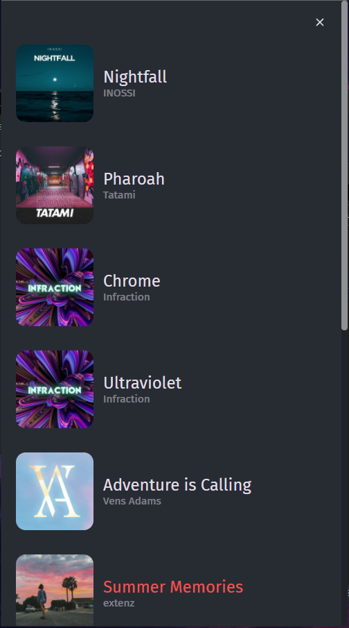

# React Music Player

### Web

### Mobile

  
  

### Description
This is React JS project of web music player which uses a fake API to get the data from.

### What I used:
* React JS
* Typescript
* React-Modal
* Styled-Components
* Axios
* MirageJS
* uuid
